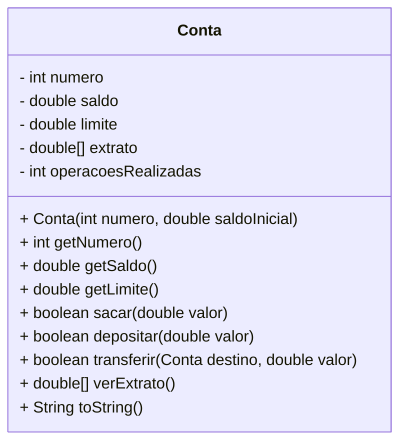

# Conta Bancária Simples

A ideia desta atividade é que você seja capaz de implementar as funcionalidades
básicas de uma conta bancária.

<figure>
  
  <figcaption style="text-align: center"><a href="https://www.freevector.com/free-iconic-atm-vectors-25886">Imagem obtida em freevector.com</a></figcaption>
</figure>


- [Requisitos](#requisitos)
- [Diagrama](#diagrama)
- [Exemplo de execução](#exemplo-de-execução)


## Requisitos

- Inicialização
  - O número da conta e o saldo inicial devem ser informados no momento da criação da conta
  - Toda conta começa com limite de 100 e com o extrato vazio (nenhuma operação registrada)
  - O extrato suporta no máximo 10 operações; quando estiver cheio, novas operações não devem ser realizadas (o método retorna `false`)
- Saldo e limite
  - O limite funciona como um "cheque especial": se o valor sacado for maior que o saldo, o saldo fica zerado e a diferença é descontada do limite. O saldo nunca fica negativo
  - `getSaldo()` retorna o saldo disponível para uso, isto é, o saldo mais o limite disponível
  - `getLimite()` retorna o limite ainda disponível
- Saques
  - Não deve ser possível sacar um valor negativo
  - Não deve ser possível sacar um valor maior que o saldo disponível (saldo + limite)
- Depósitos
  - Não deve ser possível depositar um valor negativo
  - Se parte do limite tiver sido utilizada, o depósito deve primeiro restaurar o limite (até 100) e só o que sobrar vai para o saldo
- Transferência
  - O usuário deve informar a conta de destino e o valor
  - A transferência segue as mesmas regras do saque: o valor não pode ser negativo nem maior que o saldo disponível
  - O valor transferido entra na conta de destino como um depósito
- Extrato
  - Apenas as operações realizadas com sucesso devem ser registradas
  - Saques e transferências são registrados com valor negativo (ex.: `-200.0`) e depósitos com valor positivo (ex.: `500.0`)
  - `verExtrato()` retorna um array somente com as operações realizadas, na ordem em que ocorreram (o tamanho do array é igual ao número de operações realizadas)
- Representação textual
  - `toString()` deve retornar a conta no formato `Conta{numero=1001, saldo=2000.0, limite=100.0}`, em que `saldo` é o saldo sem o limite
  

## Diagrama



## Exemplo de execução 

```java
public class Runner {

    public static void main(final String[] args) {

        Conta minhaConta = new Conta(1001, 2000);
        System.out.println(minhaConta); //Conta{numero=1001, saldo=2000.0, limite=100.0}

        Conta destino = new Conta(10, 0);

        minhaConta.sacar(200);
        System.out.println(minhaConta); //Conta{numero=1001, saldo=1800.0, limite=100.0}

        if(!minhaConta.sacar(10000)){
            System.out.println("Saldo insuficiente"); //Saldo insuficiente
        }

        minhaConta.depositar(500);
        System.out.println(minhaConta); //Conta{numero=1001, saldo=2300.0, limite=100.0}

        minhaConta.transferir(destino, 400);
        System.out.println(minhaConta); //Conta{numero=1001, saldo=1900.0, limite=100.0}

        if(!minhaConta.transferir(destino, 4000000)) {
            System.out.println("Saldo insuficiente"); //Saldo insuficiente
        }

        // o saque é maior que o saldo (1900): o saldo zera e os 50 restantes saem do limite
        minhaConta.sacar(1950);
        System.out.println(minhaConta); //Conta{numero=1001, saldo=0.0, limite=50.0}

        // o depósito primeiro restaura o limite utilizado
        minhaConta.depositar(50);
        System.out.println(minhaConta); //Conta{numero=1001, saldo=0.0, limite=100.0}

        // as operações que falharam (sacar 10000 e transferir 4000000) não aparecem no extrato
        double[] extrato = minhaConta.verExtrato();
        for(int i = 0; i < extrato.length; i++) {
            System.out.println(extrato[i]); // -200.0 500.0 -400.0 -1950.0 50.0
        }
    }
}
```
